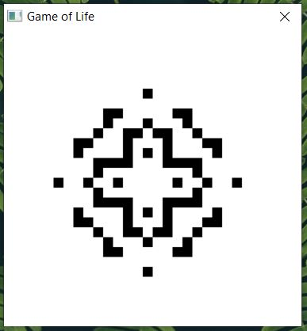

# Game of Life
Conway's Game of Life implemented in C++ and WinAPI.

## Usage
* Click on cells to change their state
* Press Enter to advance by one iteration
* Hold Enter to continuously iterate

## Screenshots

## License
[MIT License](LICENSE.txt)